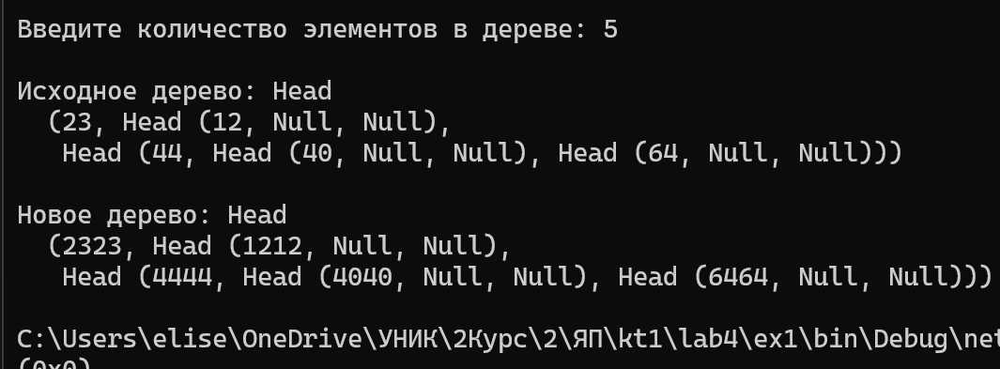
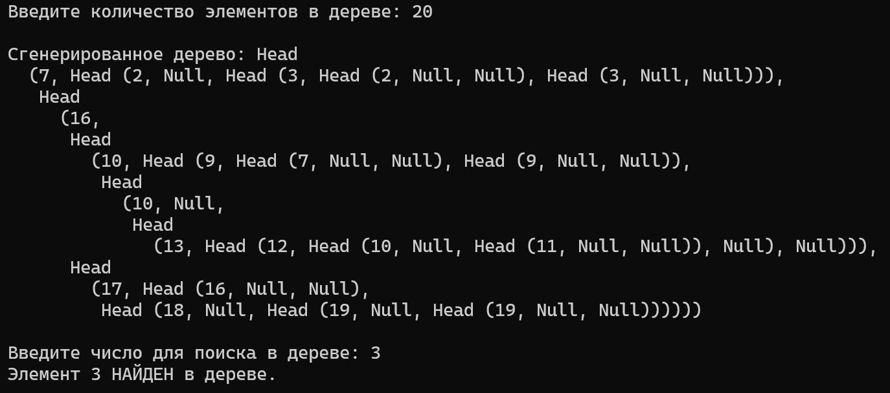

# Мартелов Елисей Группа ИТС1 Лабораторная №3

## Задание 1

### Задача 1

### Текст задачи

#### Дерево содержит строки. В конец каждой строки приписать ее же

### Алгоритм решения

###### 

#### КОММ

### Тестирование

## Задание 2

### Задача 1

### Текст задачи

#### Выяснить, содержится ли в дереве элемент с заданным значением.

### Алгоритм решения

###### 

####  КОММ

### Тестирование

